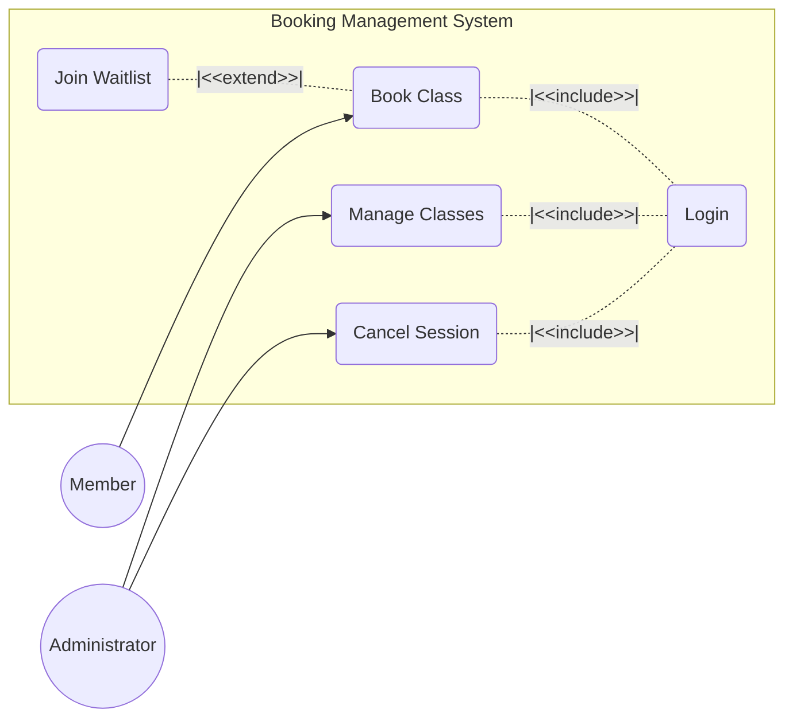
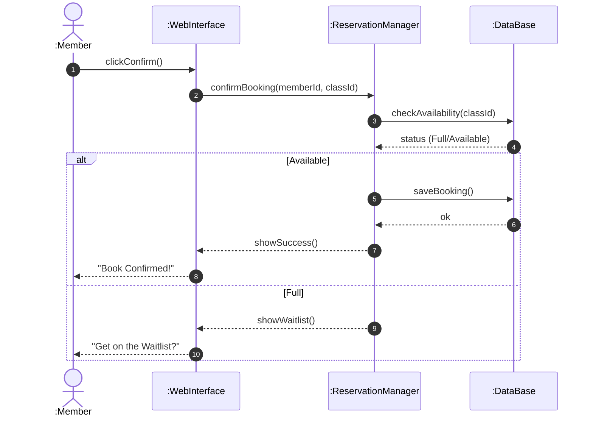
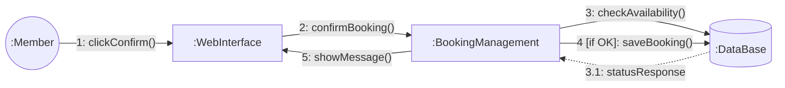

# Entornos-7.5
EJERCICIO 1:

```mermaid
flowchart LR
 subgraph GymMaster_System["Booking Management System"]
        UC1("Login")
        UC2("Book Class")
        UC3("Join Waitlist")
        UC4("Manage Classes")
        UC5("Cancel Session")
  end
    UC2 -. |&lt;&lt;include&gt;&gt;| .- UC1
    UC3 -. |&lt;&lt;extend&gt;&gt;| .- UC2
    UC4 -. |&lt;&lt;include&gt;&gt;| .- UC1
    UC5 -. |&lt;&lt;include&gt;&gt;| .- UC1
    Member(("Member")) --> UC2
    Admin(("Administrator")) --> UC4 & UC5
```
EJERCICIO 2:

```mermaid
sequenceDiagram
    autonumber
    actor Member as :Member
    participant UI as :WebInterface
    participant Controller as :ReservationManager
    participant DB as :DataBase

    Member->>UI: clickConfirm()
    
    UI->>Controller: confirmBooking(memberId, classId)
    
    Controller->>DB: checkAvailability(classId)
    DB-->>Controller: status (Full/Available)

    alt Available
        Controller->>DB: saveBooking()
        DB-->>Controller: ok
        Controller-->>UI: showSuccess()
        UI-->>Member: "Book Confirmed!"
    else Full
        Controller-->>UI: showWaitlist()
        UI-->>Member: "Get on the Waitlist?"
    end
```

EJERCICIO 3:

```mermaid
graph LR
    Socio((:Member)) -- "1: clickConfirm()" --> UI[:WebInterface]
    UI -- "2: confirmBooking()" --> Controller[:BookingManagement]
    
    %% La comunicación entre el gestor y la base de datos
    Controller -- "3: checkAvailability()" --> DB[(:DataBase)]
    DB -. "3.1: statusResponse" .-> Controller
    
    %% Si todo está bien, se guarda
    Controller -- "4 [if OK]: saveBooking()" --> DB
    
    %% Respuesta final al socio
    Controller -- "5: showMessage()" --> UI
```
